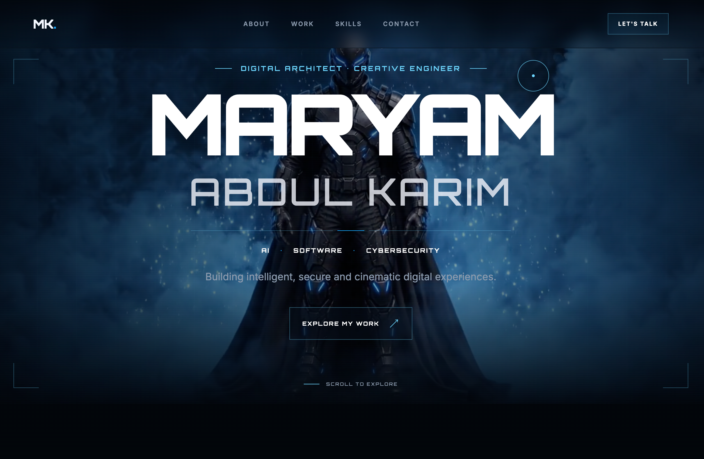
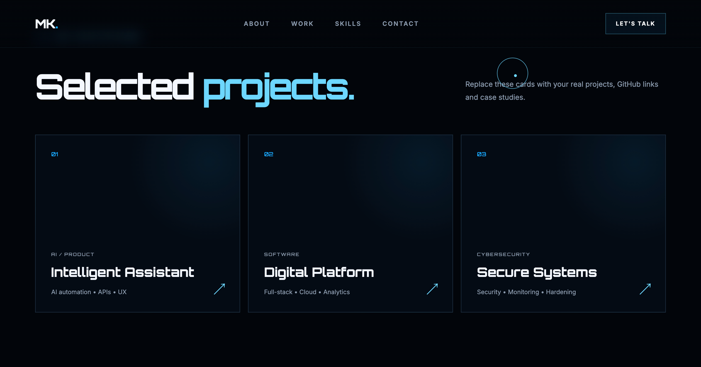
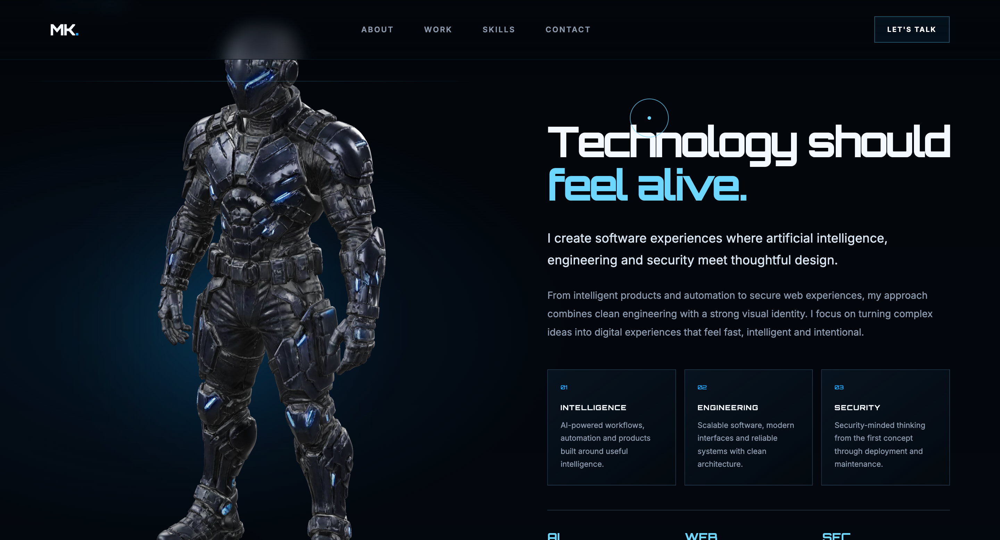

# ⚡ Maryam Abdul Karim — AI • Software • Cybersecurity

<p align="center">
  
</p>

<h3 align="center">
  Digital Architect • Creative Engineer
</h3>

<p align="center">
  A cinematic personal portfolio focused on Artificial Intelligence,
  Software Engineering, and Cybersecurity.
</p>

<p align="center">

<a href="YOUR_LIVE_WEBSITE_URL">

</a>

<a href="https://github.com/maryamabdulkarim361-lab">

</a>

<a href="https://www.linkedin.com/in/maryamabdulkarim361/">

</a>

<a href="https://www.upwork.com/freelancers/~013954875ad706a30d?mp_source=share">

</a>

</p>

---

## ✨ About The Project

This is my personal developer portfolio designed to showcase my work,
technical interests, projects, and capabilities across:

- 🤖 Artificial Intelligence
- 💻 Software Engineering
- 🔐 Cybersecurity
- 🌐 Web Development
- 📱 Application Development

The website combines a **cinematic visual experience** with a clean,
structured portfolio layout to create a memorable way of presenting
technical work.

---

## 🎨 Design Concept

The portfolio follows a futuristic, cinematic visual direction.

### Visual language

- 🌑 Dark cinematic interface
- 🔵 Electric blue accents
- 🤖 Futuristic character / armor visuals
- ✨ Subtle glowing effects
- 🧩 Technical grid elements
- 🎬 Animated interactions
- 📐 Minimal geometric UI
- 🖱️ Interactive elements

The goal was to create something that feels more like a **digital
experience** than a traditional resume website.

---

# 🏠 Portfolio Sections

## 01 — Hero Section

The landing section introduces:

> **MARYAM ABDUL KARIM**

along with my focus areas:

**AI • SOFTWARE • CYBERSECURITY**

The hero section uses a cinematic visual background and interactive
elements to immediately establish the site's visual identity.

---

## 02 — About / Introduction

The introduction section communicates my approach to technology:

> Technology should feel alive.

It focuses on building software experiences where:

- Artificial Intelligence
- Engineering
- Security
- Design

work together to create meaningful digital products.

---

## 03 — Selected Projects

The portfolio contains a dedicated project section for showcasing
selected work.

Current project categories include:

### 🤖 Intelligent Assistant

AI-powered applications and intelligent workflows.

### 💻 Digital Platform

Modern software platforms and web applications.

### 🔐 Secure Systems

Security-focused systems and cybersecurity-related projects.

---

## 04 — Technology & Expertise

The portfolio organizes my technical interests into three primary
areas:

### 🤖 Artificial Intelligence

- Machine Learning
- AI Agents
- LLM Applications
- Intelligent Automation
- Data Processing

### 💻 Software Engineering

- Python
- Django
- REST APIs
- JavaScript
- React
- React Native
- Database Development

### 🔐 Cybersecurity

- Web Security
- Linux
- Networking
- Security Fundamentals
- Secure Application Development

---

## 🛠️ Technologies

> Update this list according to the exact technologies used in the
> current implementation.

### Frontend


### Development


### Tools


---

# ⚡ Key Features

- 🎬 Cinematic portfolio design
- 🌑 Dark futuristic UI
- 📱 Responsive layout
- 🧭 Structured navigation
- ✨ Interactive visual elements
- 🧩 Project showcase
- 🤖 AI-focused personal branding
- 🔐 Cybersecurity-focused identity
- 💼 Professional contact section
- 🔗 Social and professional links

---

# 📸 Screenshots

## Hero Section

<p align="center">
  
</p>

## Selected Projects

<p align="center">
  
</p>

## Technology Section

<p align="center">
  
</p>

```markdown

